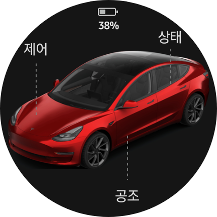
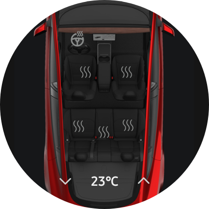
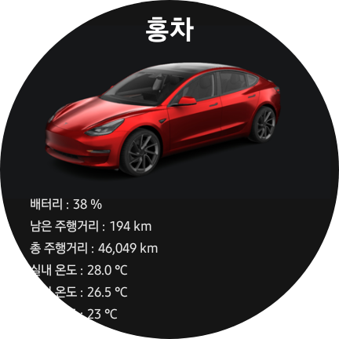

# Tesla WearOS — Galaxy Watch Native App

Tesla Fleet API 기반 브릿지 서버에 연결하는 네이티브 Google Wear OS 앱입니다.

---

## 구현 방식

Galaxy Watch 6은 **WebView를 지원하지 않습니다** (`WebViewFactory.getProvider` → `UnsupportedOperationException`).  
이 앱은 Gradle 없이 `javac + d8 + aapt`로 빌드한 **완전한 네이티브 Android View 앱**입니다.

- 모든 UI를 `FrameLayout`, `ImageView`, `TextView`, `ScrollView`로 코드에서 직접 구성
- 480dp 기준 디자인을 `widthPixels / 480f` 스케일로 실기기 해상도에 맞게 적용
- `ValueAnimator` 기반 커스텀 애니메이션 (점선 성장, 페이드 인/아웃)
- `DashLine` 커스텀 뷰: 위→아래 / 아래→위 방향 점선 성장 애니메이션
- Wear OS 4 뒤로가기: `OnBackInvokedCallback` (API 33+) 적용
- 적응형 아이콘 (`mipmap-anydpi-v26`) 및 밀도별 mipmap 리소스 포함

---

## 명령 전송 방식

```
Galaxy Watch 6
    └─ HTTPS → Caddy (Let's Encrypt TLS)
        └─ FastAPI Bridge
            └─ tesla-http-proxy (mTLS 서명)
                └─ Tesla Fleet API
```

- 모든 명령은 백그라운드 스레드에서 HTTPS POST로 전송
- 차량 슬립 감지 시 자동 Wake → 최대 30초 대기 후 명령 실행
- 슬립 판별: `/api/state` 응답의 `"cached": true` 여부로 구분
- 프렁크 · 트렁크: 길게 눌러 확인 다이얼로그 후 실행 (오작동 방지)

---

## 화면 구성

### 1. 메인 화면

<!-- 스크린샷을 여기에 추가하세요 -->


- 차량 이미지 페이드 인 → 점선 성장 → 라벨·배터리 페이드 인 순서의 인트로 애니메이션
- 배터리 잔량 실시간 표시 (커스텀 `BatteryView`)
- 제어 / 공조 / 상태 화면으로 이동하는 탭 레이블

---

### 2. 제어 화면

<!-- 스크린샷을 여기에 추가하세요 -->


- 도어 잠금 / 잠금 해제 (현재 상태에 따라 아이콘 색상 변경)
- 프렁크 열기 (길게 눌러 확인)
- 트렁크 열기 (길게 눌러 확인)
- 충전 포트 열기 / 닫기
- 버튼 클릭 시 원형 리플 피드백 표시

---

### 3. 공조 화면

<!-- 스크린샷을 여기에 추가하세요 -->


- 공조 ON/OFF 상태에 따라 배경 이미지 크로스페이드 전환
- 설정 온도 표시 및 ±1℃ 조절 (▲▼ 버튼)
- 좌석 히터 5개 (운전석·조수석·뒤좌·뒤중·뒤우) 개별 단계 제어 (OFF→1단→2단→3단 순환)
- 스티어링 휠 히터 ON/OFF
- 중앙 온도 숫자 탭으로 공조 켜기 / 길게 눌러 공조 끄기

---

### 4. 상태 화면

<!-- 스크린샷을 여기에 추가하세요 -->


- 배터리·주행거리·총 주행거리·소프트웨어 버전 등 차량 상태 텍스트 표시
- 스크롤 시 차량 이미지·차명 페이드 아웃 → 텍스트만 남는 효과
- 차대번호(VIN) 표시
- 원형 워치 화면 하단 잘림 방지를 위한 여백 처리

---

## 기술 스택

| 항목 | 내용 |
|------|------|
| 대상 기기 | Galaxy Watch 6 (Wear OS 4) |
| 최소 SDK | API 30 (Wear OS 3) |
| 빌드 방식 | javac + d8 + aapt (Gradle 미사용) |
| UI 구성 | 완전 코드 기반 네이티브 View (WebView 미사용) |
| 애니메이션 | ValueAnimator, ViewPropertyAnimator |
| 통신 | HTTPS (HttpURLConnection, 백그라운드 스레드) |
| 인증 | BRIDGE_TOKEN (단일 토큰 인증) |
| 뒤로가기 | OnBackInvokedCallback (Wear OS 4 / API 33+) |

---

## 빌드 방법

```bash
# secrets.xml 생성 (실제 값 입력)
cp secrets.xml.example res/values/secrets.xml
# 편집기로 bridge_base, bridge_key 값 입력

# 키스토어 생성 (최초 1회)
keytool -genkey -v -keystore tesla-watch.keystore -alias teslawatch -keyalg RSA -keysize 2048 -validity 10000

# 빌드
bash build.sh
```

---

## 보안

- `secrets.xml` 및 `*.keystore`는 `.gitignore`로 제외됨
- 브릿지 토큰 없이는 서버 접근 불가
- HTTPS 전용 통신
